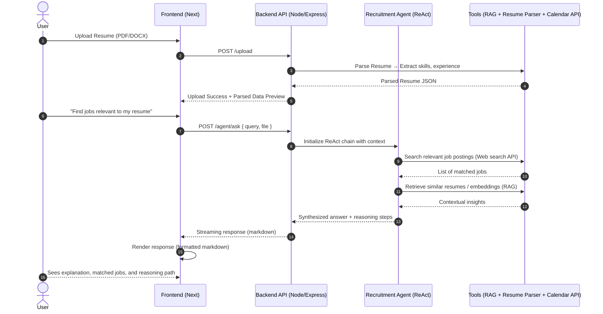

# Recruitment Agent — LLM-Powered Job Matching Assistant

## 🧠 Overview

The Recruitment Agent is an AI assistant that analyzes resumes, performs live web searches, and recommends relevant job postings.  
Built using Retrieval-Augmented Generation (RAG) and multi-tool agent orchestration.

## 📀 Demo Video

[Recruitment Agent Demo.mp4](https://drive.google.com/file/d/1idbzcktNUy_PKdGWPWJSIEc8D5B_E3HY/view?usp=drive_link)

---

## 🏗️ Architecture Diagram

## 🛠️ How to run

#### Backend

- cd backend
- cp .env.example .env
- Fill in OpenAI / Pinecone / Google keys
- npm install && npm run dev

#### Frontend

- cd frontend
- cp .env.example .env.local
- Add NEXT_PUBLIC_API_URL={backend-url}
- npm install && npm run dev

## 🏗️ Key Components

| Component               | Description                                            |
| ----------------------- | ------------------------------------------------------ |
| **Embeddings Pipeline** | Upload → Chunk → Embed → Upsert to Pinecone            |
| **RAG Endpoint**        | Retrieves chunks + LLM answer with inline citations    |
| **Agent Planner**       | LLM-driven JSON planner selecting tools                |
| **Tools**               | `vector_search`, `web_search`, `calendar`              |
| **Trace Logger**        | Step-wise decision trace for replay/debug              |
| **Streaming UI**        | Client-side markdown renderer for real-time LLM output |

## 🔒 Security Notes

- Tool actions validated via actionValidator.
- API keys isolated via .env.
- Rate limiting active on backend.

## ✍️ Author

Deven Bansal
[LinkedIn](https://www.linkedin.com/in/deven-bansal/) | [Mail](mailto:deven.bansal01@gmail.com) | [GitHub](https://github.com/devenbansal-ai)
